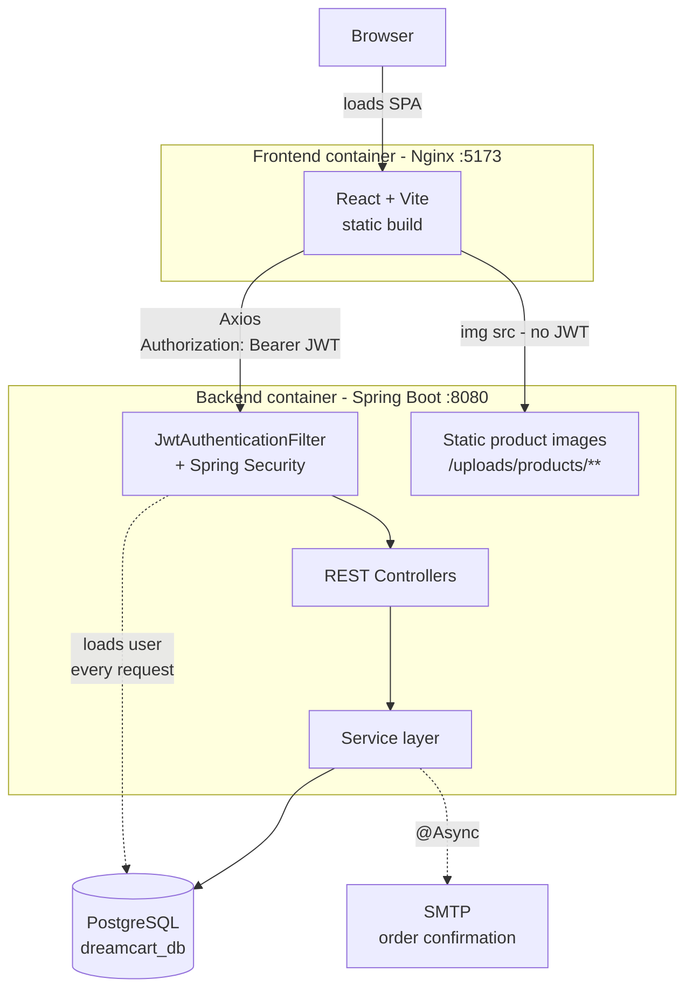
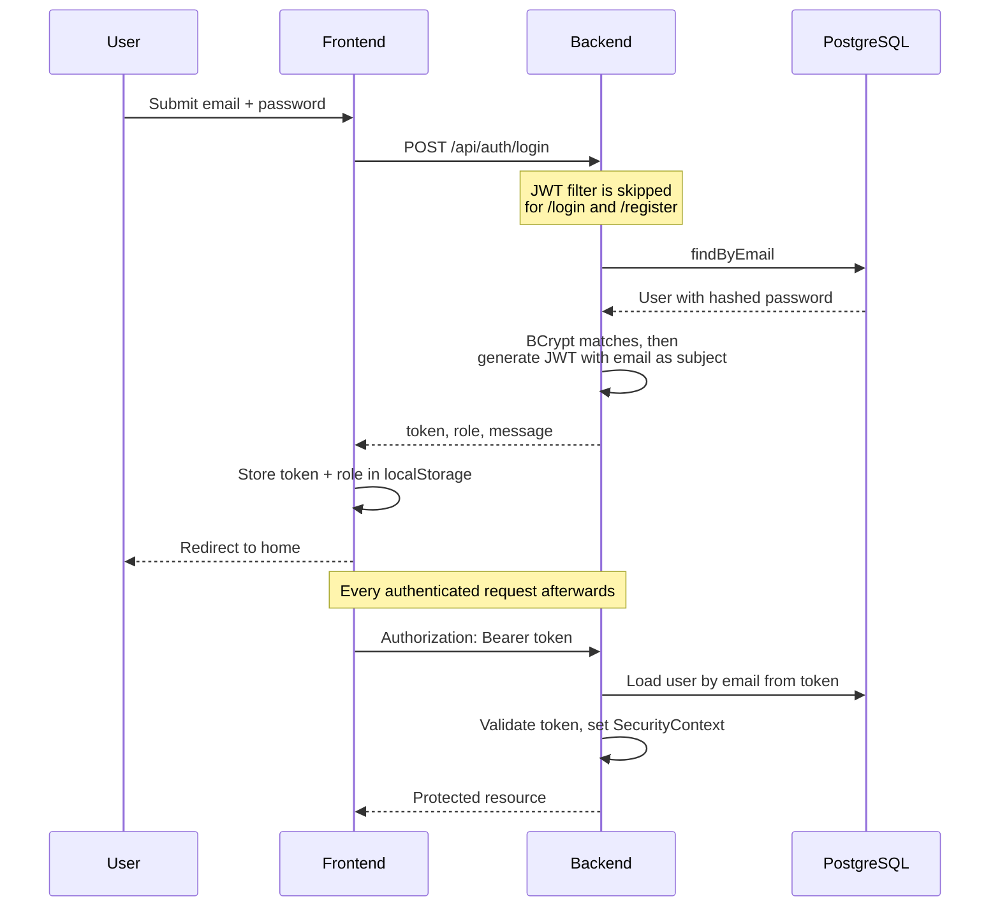
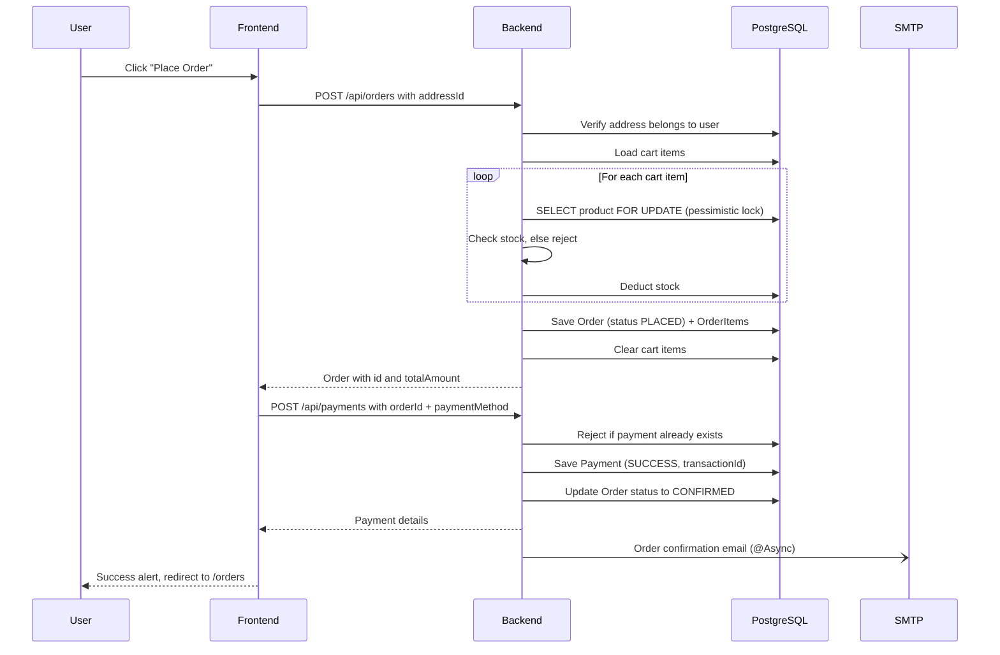

# DreamCart — Backend

The REST API powering **DreamCart**, a full-stack e-commerce platform. Built with Spring Boot and PostgreSQL, it handles authentication, product catalog, cart, wishlist, checkout, payments, order management, product reviews, and admin operations.

Frontend repo: [dreamcart-frontend](https://github.com/sushilranavare/dreamcart-frontend)

## Tech Stack

- Java 21, Spring Boot 3
- Spring Security with stateless JWT authentication
- Spring Data JPA / Hibernate
- PostgreSQL
- Lombok
- springdoc-openapi (Swagger UI)
- Spring Mail (order confirmation emails, sent asynchronously)
- JUnit 5 + Mockito (unit tests)
- Docker / Docker Compose

## Features

- JWT-based authentication and registration, with role-based access control (`USER` / `ADMIN`) enforced via `@PreAuthorize`
- Product and category browsing (public), with image upload support
- Cart and wishlist management
- Checkout flow with shipping addresses and a simulated payment step
- Order placement with pessimistic row locking on stock deduction, so concurrent orders can't oversell inventory
- Order history for users, and status management for admins
- Product reviews (one per user per product), with average rating
- User profile management (update details, change password)
- Admin dashboard: store statistics, and management of products, categories, users, and orders
- API documentation via Swagger UI
- Centralized exception handling with consistent JSON error responses

## Architecture



## Key Flows

### Login and authenticated requests



### Checkout and payment



## Prerequisites

- Java 21
- Maven (or use the included `./mvnw` wrapper)
- PostgreSQL 16 (or run everything via Docker instead — see below)

## Running Locally

1. Create a PostgreSQL database named `dreamcart_db`.
2. Update `src/main/resources/application.properties` with your local database credentials if they differ from the defaults.
3. Run the app:
   ```bash
   ./mvnw spring-boot:run
   ```
4. The API is available at `http://localhost:8080`.

## Running with Docker

The easiest way to run the full stack (backend + frontend + PostgreSQL) together:

```bash
docker compose up --build
```

This starts:
- PostgreSQL on host port `5433` (mapped to container port `5432`, to avoid clashing with a local Postgres install)
- Backend on `http://localhost:8080`
- Frontend on `http://localhost:5173`

The compose file assumes `dreamcart-backend` and `dreamcart-frontend` are cloned as sibling directories. See `docker-compose.yml` for details.

## API Documentation

Once the backend is running, interactive API docs are available at:

```
http://localhost:8080/swagger-ui.html
```

Authenticate via `POST /api/auth/login`, then paste the returned JWT into Swagger UI's "Authorize" button to test protected endpoints directly.

## Testing

Run the backend unit test suite (JUnit 5 + Mockito):

```bash
./mvnw test
```

## Project Structure

```
src/main/java/com/dreamcart/backend/
├── controller/    REST endpoints
├── service/       Business logic
├── repository/    Spring Data JPA repositories
├── entity/        JPA entities
├── dto/           Request/response DTOs
├── security/      JWT filter and Spring Security configuration
├── config/        App-wide configuration (OpenAPI, async, static resources)
└── exceptions/    Global exception handling
```
